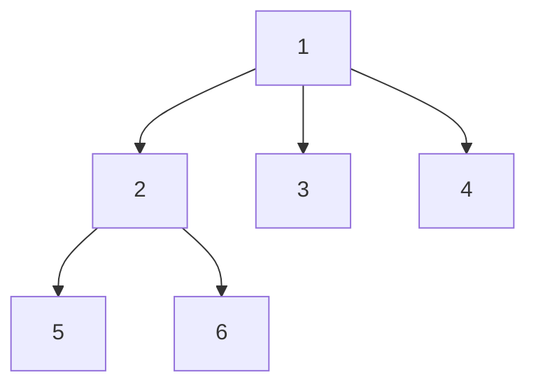

# Tree Assignment

## Background

You are requested to implement a tree data structure which is based on abstract nodes. Each node has *zero or more children* and *zero or one parent*. Nodes are created and added as children to their parent nodes in run time. Upon creation each node requests an asynchronous resource, which is supposed to become ready later (in an unpredictable timeframe or order), a callback can be given to the resource in order for the node to be notified about its readiness.

The main challenge of the assignment is telling whether a node (or subtree) is ready. A node is considered ready only when it has its resource ready, and all of its descendants have their resources ready too.

## Method

You are given an example `Resource` class, which becomes ready randomly within 200-1000 ms, and two boilerplate classes: `SimpleNode` and `AsyncNode`, to be implemented by you so that it fulfils the requirements in each of the steps.

The steps are based on each other:
 1. `SimpleNode` a synchronous node class
 2. `AsyncNode` an asynchronous node class

Your solution needs to cover at least the methods marked with the comment "implement", you can also add and change whatever you like in these classes, as long as you preserve the existing methods structure. Note that the `AsyncNode` is derived from `SimpleNode` in the previous step and should not break any existing functionality.

This assignment should be completed in ​either​ latest Node.js or Python 3.x.

## Graph Example



- If 6 has its resource ready, then 6 is considered ready since it has no children
- If 2 and 6 have their resources ready, 2 isn't considered ready since 5 isn't ready yet
- If 2, 3, and 4 have their resources ready, 1 isn't considered ready since 5 and 6 aren't ready yet

## Review Criteria

 - Readability and tidiness
 - Efficiency
 - Passing provided tests
   ```
   cd test-js
   npm test
   ```
   -- or --
   ```
   cd test-py
   python3 -m unittest
   ```
